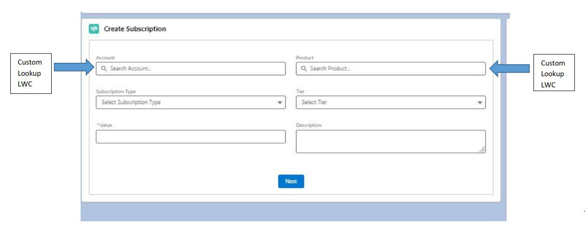
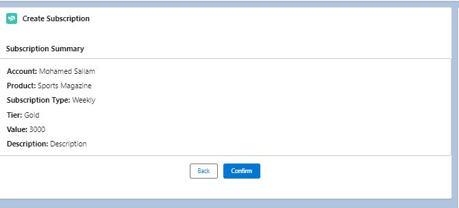

# Salesforce LWC Subscription Management

This project implements a subscription management App in Salesforce using Lightning Web Components (LWC) and Apex controllers.

## Components
### 1. Custom Lookup Component
- **Purpose**: Provides a dynamic lookup field to search for Account or Product records.
- **Files**:
  - `customLookup.js`
  - `customLookup.html`
  - `customLookup.js-meta.xml`
- **Apex Controller**: `CustomLookupController.cls`
  - Handles search and fetching of default records.

### 2. Subscription Component
- **Purpose**: Allows users to create a new subscription tied to Account and Product.
- **Files**:
  - `subscriptionComponent.js`
  - `subscriptionComponent.html`
  - `subscriptionComponent.js-meta.xml`
- **Apex Service**: `SubscriptionService.cls`
  - Handles the subscription creation logic, including duplicate prevention.

## Create Subscription UI

## Subscription Summary UI

